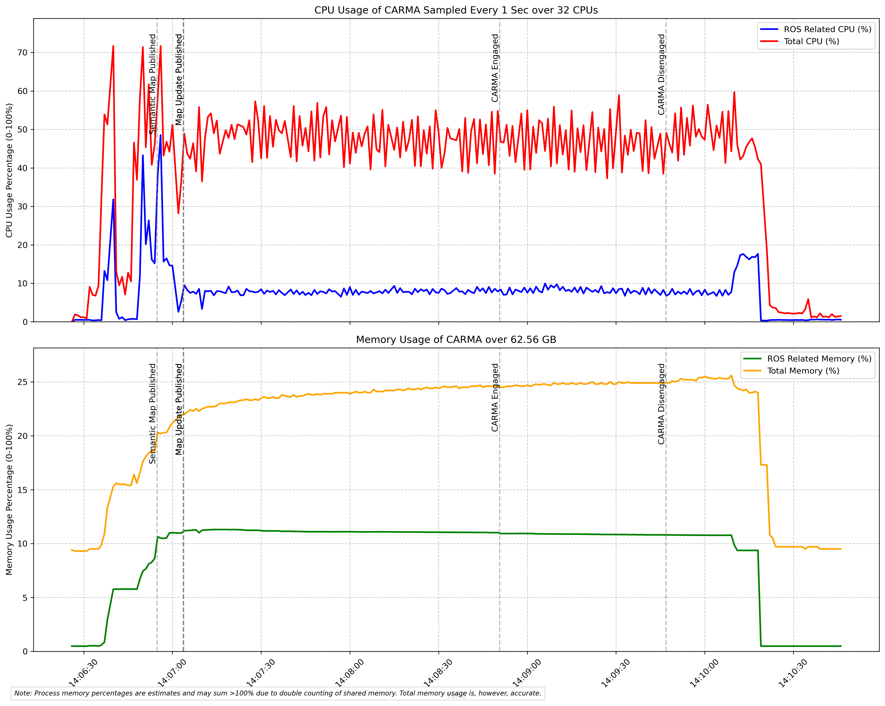

# System Resource Usage Plot Documentation

## Overview
This script generates system resource usage plots from CSV data collected during CARMA Platform execution, displaying both CPU and memory utilization. It can also overlay important events from a corresponding MCAP file onto the plots, such as system engagement/disengagement times and map updates.

## Features
- Visualizes CPU and memory usage trends over time
- Shows both ROS related and total CPU usage
- Displays total memory consumption percentage
- Marks notable events from MCAP files (optional)
- Robust timezone difference handling between CSV and MCAP data (since host machine and container time may vary)
- Supports custom CPU core count configuration for different PCs

## Prerequisites
- Python 3.x
- Required Python packages:
  - pandas
  - matplotlib
  - rosbag2 (for MCAP file handling)

## Usage

### Basic Command
```bash
python3 carma_system_resource_usage_plot.py <csv_file> [-m MCAP_FILE] [-c CPU_COUNT] [-o OUTPUT_FILE]
```

### Arguments
- `csv_file`: Path to the input CSV file containing system resource usage data
- `-m, --mcap`: (Optional) Path to the corresponding ROS2 MCAP file
- `-o, --output`: (Optional) Path for the output PNG file

### Example
```bash
python3 carma_system_resource_usage_plot.py cpu_usage_ros2_nodes_2024_11_19-01_41_49.csv -c 32 -m rosbag2_2024-11-19_064200_0.mcap
```

## Input Format

### CSV File Format
The input CSV file should contain the following columns:
- `Timestamp`: Time of the measurement
- `CPU (%)`: CPU usage percentage per process
- `Memory (%)`: Memory usage percentage per process
- `Total CPU (%)`: Total system CPU usage percentage
- `Total CPU Num`: Total system CPU numbers (should be static)
- `Total Memory (%)`: Total Virtual Memory usage percentage
- `Total Memory (GB)`: Total Virtual Memory sizei in GB (should be static)

### MCAP File Events
The script extracts the following events from MCAP files:
- CARMA System Engagement
- CARMA System Disengagement
- Semantic Map Publications
- Map Updates

## Output

### Plot Contents
The generated plot includes two subplots:

CPU Usage (Top):
- Blue line: ROS related CPU usage
- Red line: Total CPU usage
- Grid lines for easier reading

Memory Usage (Bottom):
- Green line: ROS related processes memory usage (using proportional set size, PSS)
- Yellow line: Total Virtual Memory usage
- Grid lines for easier reading

> [!NOTE]
> Unlike CPU measurements where process percentages sum up to total usage, memory measurements of individual processes may exceed the total system memory usage when summed. This occurs because memory can be shared between processes, leading to double-counting in per-process measurements. While using proportional set size (PSS) provides better estimates, it still may not perfectly reflect actual memory allocation due to the complex nature of memory sharing.

Shared Features:
- Vertical gray lines: Notable events from MCAP file (if provided)
- Rotated timestamps for better readability
- Event markers synchronized between both plots

### Example Output


The plots show CPU and memory usage over time with marked events indicating system state changes and map updates. The x-axis shows the timestamp, and the y-axes show the respective resource usage percentages.