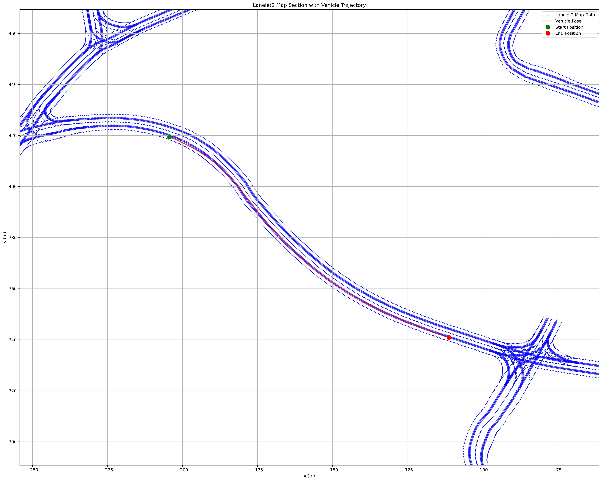

# Environment Scripts

This file contains analysis functions for processing and visualizing MCAP files containing ROS2 messages, focusing on environmental data and vehicle trajectories.

NOTE: some functions in this file uses `mcap-ros2-support` which can be installed by `pip install mcap-ros2-support`

## Functions

### extract_lanelet2_map_from_mcap

Extracts Lanelet2 map data points from an MCAP file using the `/environment/lanelet2_map_viz` topic.

#### Parameters

- `filename`: Path to MCAP file

#### Output

- Returns a list of (x, y) coordinate tuples representing map points

### extract_pose_points_from_mcap

Extracts vehicle pose data from an MCAP file using the `/localization/current_pose` topic.

#### Parameters

- `filename`: Path to MCAP file

#### Output

- Returns a tuple: (timestamps, pose_data)
  - `timestamps`: List of message timestamps in nanoseconds
  - `pose_data`: List of (x, y) coordinate tuples representing vehicle positions

### filter_map_points_for_trajectory

Filters Lanelet2 map points to show only the relevant section near the vehicle's trajectory.

#### Parameters

- `lanelet_points`: List of map points as (x, y) tuples
- `pose_x`: List of x-coordinates from vehicle trajectory
- `pose_y`: List of y-coordinates from vehicle trajectory
- `buffer`: Additional distance in meters to include around trajectory bounds (default: 50)

#### Output

- Returns a tuple: (filtered_points, bounds)
  - `filtered_points`: List of map points within the bounded area
  - `bounds`: Tuple of (min_x, max_x, min_y, max_y) defining the filtered area

### plot_2d_map_and_pose

Creates a 2D visualization of the Lanelet2 map and vehicle trajectory.

#### Parameters

- `lanelet2_data`: List of map points as (x, y) tuples
- `pose_data`: List of vehicle pose points as (x, y) tuples
- `output_dir`: Directory to save the generated plot (optional)

#### Output

- Saves a PNG file named 'lanelet2_map_section_with_trajectory.png'

#### Example Plot

The generated plot includes:
- Blue dots representing map points
- Red line showing vehicle trajectory
- Green marker indicating start position
- Red marker indicating end position
- Grid and legend for reference



## Usage

To run the script:

```bash
python environment_scripts.py <path_to_mcap_file>
```
