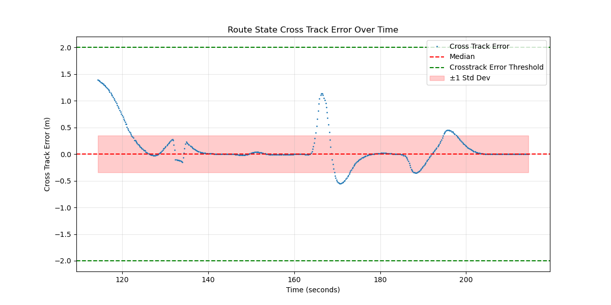
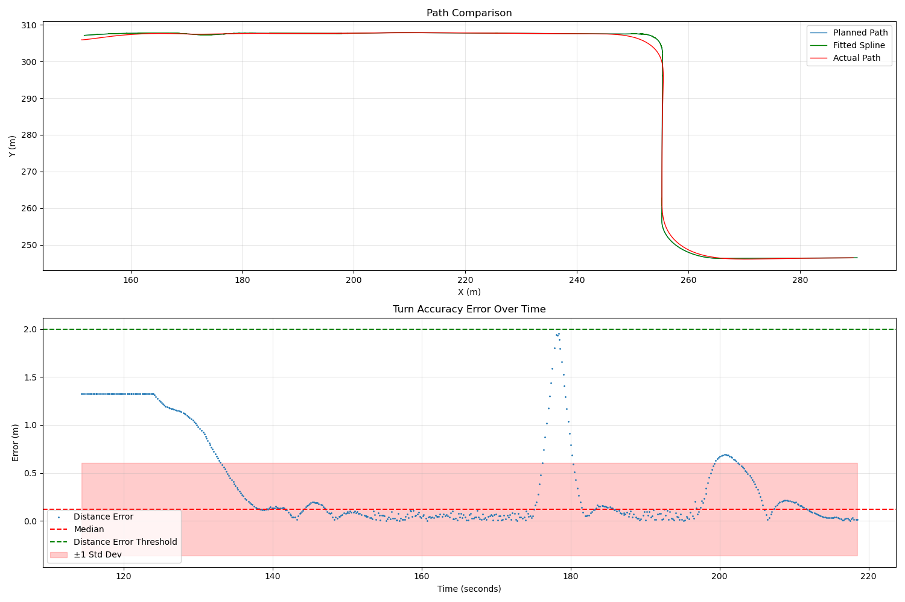
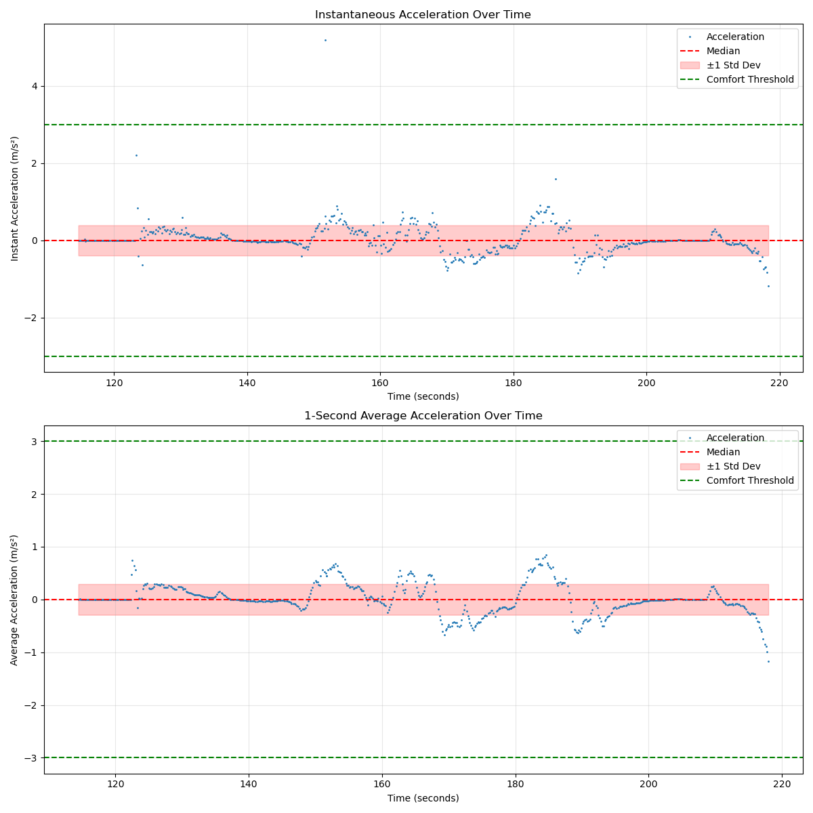
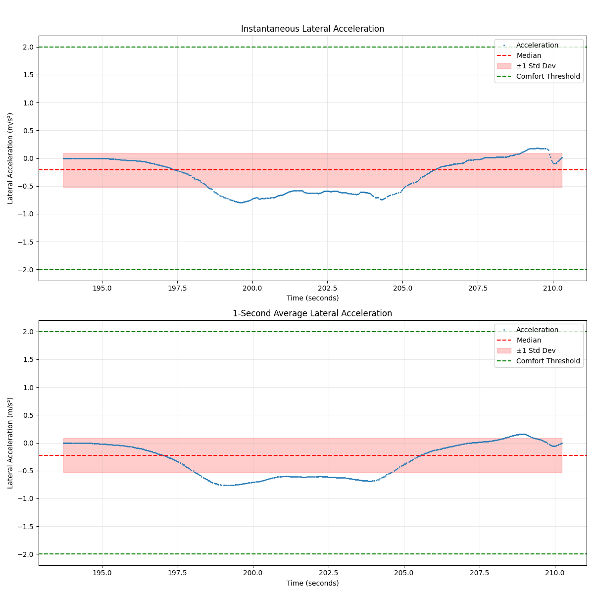
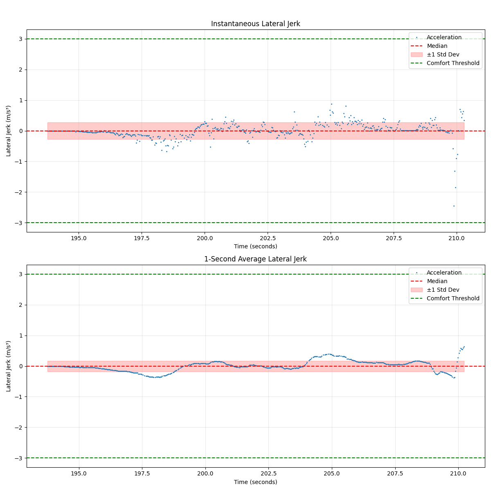
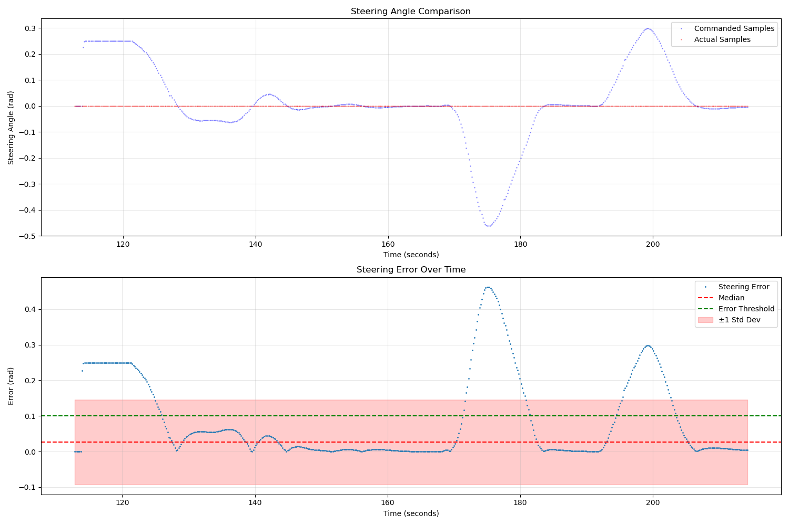
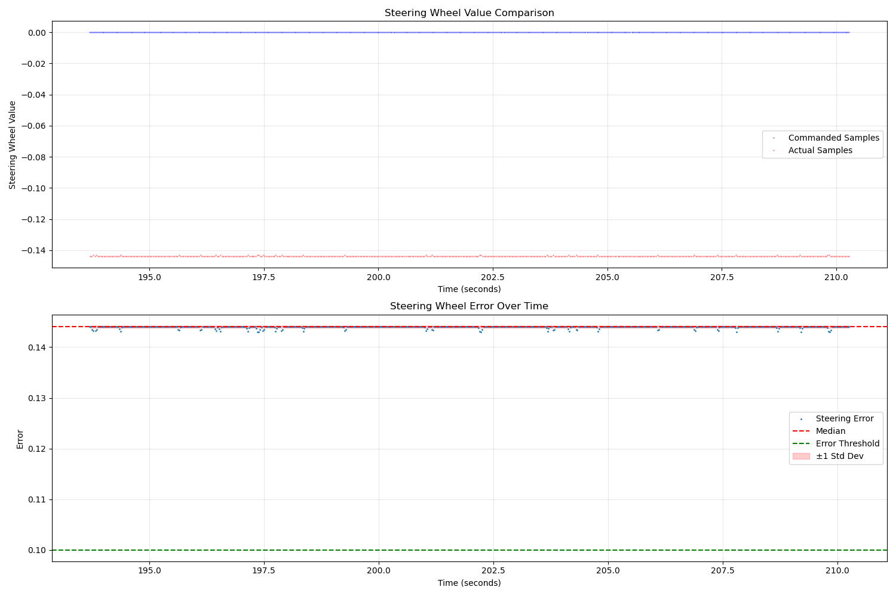
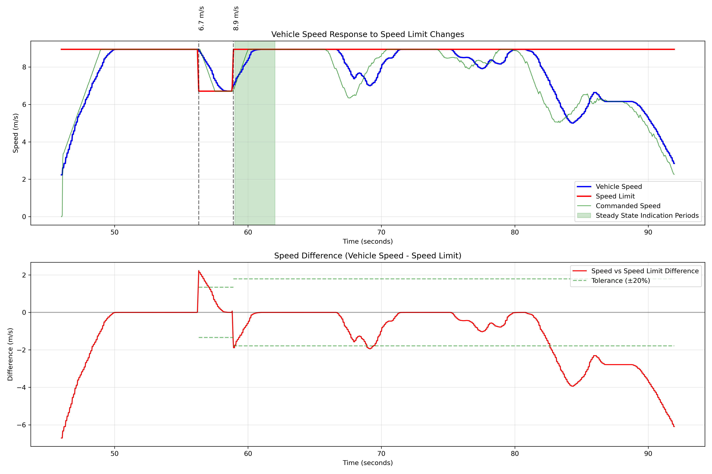

# Guidance Scripts

This file contains various analysis functions for CARMA Platform data, focusing on guidance and control aspects.

## Functions

### get_engage_time

Get the (engage, disengage_time) as a tuple from `/guidance/state`. Returns last recorded time if no disengaged.
NOTE: If there are multiple engage operations, it will only take the first engage time as the start_time.

#### Parameters

- `mcap_path`: Path to MCAP file

#### Output

- Returns a tuple: (start_time, end_time)

### run_crosstrack_analysis

Analyzes cross-track error from CARMA Platform's internal route logic using topic `/guidance/route_state`

#### Parameters

- `mcap_path`: Path to MCAP file
- `error_threshold_to_pass_meter`: Threshold for passing the analysis (default: 2.0 meters)
- `start_time`: Time to start the analysis (optional)
- `end_time`: Time to end the analysis (optional)
- `save_stats_dir`: Directory to save extracted statistics (optional)
- `save_data_dir`: Directory to save extracted data (optional)
- `save_plot_dir`: Directory to save generated plots (optional)

#### Output

- Returns a tuple: (is_passed, stats, plot_figure, cross_tracks, timestamps)
- Saves statistics as JSON, data as NPZ, and plot as PNG (if directories are provided)

#### Example Plot

This plot shows the cross-track error over time, including the median and standard deviation.

### run_turn_accuracy_analysis

Analyzes turn accuracy by comparing actual path to planned trajectory using spline fitting over time.
-`/localization/current_pose`: Source of actual traveled trajectory
-`/guidance/plan_trajectory`: Source of planned trajectory

#### Parameters

- `mcap_path`: Path to MCAP file
- `error_threshold_to_pass_meter`: Threshold for passing the analysis (default: 2.0 meters)
- `start_time`: Time to start the analysis (optional)
- `end_time`: Time to end the analysis (optional)
- `save_stats_dir`: Directory to save extracted statistics (optional)
- `save_data_dir`: Directory to save extracted data (optional)
- `save_plot_dir`: Directory to save generated plots (optional)

#### Output

- Returns a tuple: (is_passed, stats, plot_figure, distances, timestamps)
- Saves statistics as JSON, data as NPZ, and plot as PNG (if directories are provided)

#### Example Plot

### run_acceleration_comfort_analysis

Analyzes acceleration comfort based on vehicle status data using topic `/hardware_interface/vehicle_status` for the vehicle's speed

#### Parameters

- `mcap_path`: Path to MCAP file
- `comfort_deceleration_threshold_to_pass`: Threshold for comfort analysis (default: 3.0 m/s²)
- `start_time`: Time to start the analysis (optional)
- `end_time`: Time to end the analysis (optional)
- `save_stats_dir`: Directory to save extracted statistics (optional)
- `save_data_dir`: Directory to save extracted data (optional)
- `save_plot_dir`: Directory to save generated plots (optional)

#### Output

- Returns a tuple: (is_passed, instant_stats, avg_stats, plot_figure, accelerations, avg_accelerations, time_points, avg_time_points)
- Saves instantaneous and 1-second average statistics as JSON files
- Saves data as NPZ and plots as PNG (if directories are provided)

#### Example Plot

### run_lateral_analysis

Analyzes lateral acceleration and jerk from vehicle state data using both instantaneous and 1-second window averages. Uses twist data from vehicle interface (topic `/hardware_interface/vehicle/twist`) to calculate lateral dynamics.

#### Parameters

- `mcap_path`: Path to MCAP file
- `acc_threshold_to_pass`: Maximum acceptable lateral acceleration (default: 2.0 m/s²)
- `jerk_threshold_to_pass`: Maximum acceptable lateral jerk (default: 2.0 m/s³)
- `start_time`: Time to start the analysis (optional)
- `end_time`: Time to end the analysis (optional)
- `save_stats_dir`: Directory to save extracted statistics (optional)
- `save_data_dir`: Directory to save extracted data (optional)
- `save_plot_dir`: Directory to save generated plots (optional)

#### Output

Returns a tuple containing:

- `is_passed`: Boolean indicating if all comfort thresholds were met
- `acc_inst_stats`: Statistics for instantaneous acceleration
- `acc_avg_stats`: Statistics for 1-second average acceleration
- `jerk_inst_stats`: Statistics for instantaneous jerk
- `jerk_avg_stats`: Statistics for 1-second average jerk
- `figures`: Tuple of (acceleration_figure, jerk_figure)
- `lateral_acc_inst`: Array of instantaneous lateral acceleration values
- `lateral_acc_avg`: Array of averaged lateral acceleration values
- `lateral_jerk_inst`: Array of instantaneous lateral jerk values
- `lateral_jerk_avg`: Array of averaged lateral jerk values
- `timestamps`: Array of corresponding timestamps

#### Saved Outputs

If directories are provided:

- Statistics saved as JSON in "lateral_analysis_stats.json"
- Data saved as NPZ in "lateral_analysis_data.npz"
- Plots saved as:
  - "lateral_acceleration_analysis.png"
  - "lateral_jerk_analysis.png"

#### Example Plots

Shows instantaneous and 1-second average lateral acceleration over time.

Shows instantaneous and 1-second average lateral jerk over time.

#### Notes

- Uses vehicle's longitudinal velocity and angular velocity to calculate lateral dynamics
- Comfort thresholds are applied to both instantaneous and averaged values
- Analysis passes only if no comfort threshold violations occur in any metric
- Time-weighted averaging is used for the 1-second window calculations

### run_guidance_steering_analysis

Analyzes steering performance by comparing commanded vs actual steering angles at guidance level.
Time series alignment is performed to match commanded and actual values
Both instantaneous and statistical measures are considered
- `/guidance/ctrl_cmd`: Source of commanded steering angles
- `/hardware_interface/vehicle_status`: Source of actual vehicle steering angles

#### Parameters

- `mcap_path`: Path to MCAP file
- `error_threshold_to_pass_radian`: Threshold for passing the analysis (default: 0.1 radians)
- `start_time`: Time to start the analysis (optional)
- `end_time`: Time to end the analysis (optional)
- `save_stats_dir`: Directory to save extracted statistics (optional)
- `save_data_dir`: Directory to save extracted data (optional)
- `save_plot_dir`: Directory to save generated plots (optional)

#### Output

- Returns a tuple: (is_passed, stats, plot_figure, error_angles, common_timestamps)
- Saves statistics as JSON, data as NPZ, and plot as PNG (if directories are provided)

#### Example Plot

This plot shows:
- Top panel: Comparison of commanded vs actual steering angles over time
- Bottom panel: Steering error over time, including the median and standard deviation

### run_steering_wheel_analysis

Analyzes steering performance by comparing commanded vs actual steering values at controller level.
Both instantaneous and statistical measures are considered
- `/hardware_interface/as/pacmod/parsed_tx/steer_rpt`: (PACMOD) Source of actual and commanded steering wheel values
- `/hardware_interface/ds_fusion/steering_report`: (DATASPEED) Source of actual and commanded steering wheel values
- `/hardware_interface/steering_report`: (NEWEAGLE) Source of actual and commanded steering wheel values

#### Parameters

- `mcap_path`: Path to MCAP file
- `error_threshold_to_pass`: Threshold for passing the analysis (default: 0.1)
- `start_time`: Time to start the analysis (optional)
- `end_time`: Time to end the analysis (optional)
- `save_stats_dir`: Directory to save extracted statistics (optional)
- `save_data_dir`: Directory to save extracted data (optional)
- `save_plot_dir`: Directory to save generated plots (optional)

#### Output

- Returns a tuple: (is_passed, stats, plot_figure, error_values, timestamps)
- Saves statistics as JSON, data as NPZ, and plot as PNG (if directories are provided)

#### Example Plot

This plot shows:
- Top panel: Comparison of commanded vs actual steering wheel values over time
- Bottom panel: Steering error over time, including the median and standard deviation

#### Analysis Metrics

Both functions calculate the following statistics:
- Minimum error
- Maximum error
- Mean error
- Median error
- Standard deviation
- Root mean square error (RMSE)
- Error percentiles (25th, 75th, 95th)

#### Saved Outputs

If directories are provided:

- Statistics saved as JSON in "guidance_steering_analysis.json" and  "steering_wheel_analysis.json"
- Data saved as NPZ in "guidance_steering_data.npz" and "steering_wheel_data.npz"
- Plots saved as:
  - "guidance_steering_analysis.png"
  - "steering_wheel_analysis.png"

### get_planner_trajectory_intervals
Extract time intervals when a specific planner was active based on trajectory plans.
Uses topic `/guidance/plan_trajectory`

#### Parameters

- mcap_path: Path to MCAP file
- planner_plugin_name: Name of the planner plugin to track (e.g. `guidance/plugins/inlanecruising_plugin`)
- start_time: Optional start time to begin analysis
- end_time: Optional end time to end analysis

#### Output

Returns a list of tuples `[(start_time1, end_time1), (start_time2, end_time2), ...]` representing time intervals when the specified planner was active

### run_speed_limit_change_response_analysis
Analyze vehicle's response to speed limit changes in the map.
Passes if for each new speed limit change, the vehicle is able to get into a steady state within acceptable tolerance percentage of the new speed limit (can't be exact due to geometry of the road) and within configurable parameter of duration. Also requires that speed command should be applied within threshold after the speed limit changes. For example: True if after new speed limit change, vehicle's commanded speed is within 5% of target for at least 3 consecutive seconds and starts commanding different speed within 0.1s
NOTE: This script should be used for straightaways and speed limit change segments
      that would last at least steady_state_indication_time for best characterization

Uses topic:
/hardware_interface/vehicle/twist, /guidance/route_state, /guidance/control_cmd

#### Parameters

- `mcap_path`: Path to MCAP file
- `response_time_threshold` (seconds): Maximum acceptable response time to speed changes (default: 0.2s)
- `steady_state_duration` (seconds): Duration required at new speed to consider steady state (default: 3.0s)
- `speed_tolerance_pct`: Tolerance percentage for speed matching (to account for road geometry, default: 0.05 or 5%)
- `start_time`: Optional start time to begin analysis
- `end_time`: Optional end time to end analysis
- `save_stats_dir`: Directory to save extracted statistics (optional)
- `save_data_dir`: Directory to save extracted data (optional)
- `save_plot_dir`: Directory to save generated plots (optional)

#### Output
Returns:
Tuple containing:
- pass_results: Pass/Fail if all ciriterias pass/fail
- statistics: Detailed statistics about the analysis
- figure: Matplotlib figure object
- speed_changes: Detected speed limit change events
- response_times: Response times for each speed change

#### Example Plot

### get_geofence_entrance_and_exit_times
Gets the time_enter_geofence and time_exit_geofence by looking at is_on_active_geofence from the `/environment/active_geofence` topic. Returns the timestamps and a boolean showing it is found. Returns None, None, False if the vehicle never entered a geofence.

#### Parameters
- `mcap_path`: Path to MCAP file

#### Output
- Returns a tuple: (time_enter_geofence, time_exit_geofence, geofence_times_found)

### get_route_original_speed
Get the speed limit in m/s of the route at a specified time from `/guidance/route_state`. Returns the first speed limit if no time is specified.

#### Parameters
- `mcap_path`: Path to MCAP file
- `start_time`: Time to start the analysis

#### Output
- `original_speed_limit`: Speed limit in m/s

### check_geofence_in_reroute
Analyzes `/guidance/route` to determine whether a closed lanelet is present in either the original route or the re-route

#### Parameters
- `mcap_path`: Path to MCAP file
- `closed_lanelets`: List of closed lanelet ids

#### Output
- Returns a tuple: (initial_route_includes_closed_lane, map_updated_for_closed_lane)

### check_speed_limits_in_geofence
Checks that the vehicle processes the new speed limit after receiving a TCM with new workzone speed limit

#### Parameters
- `mcap_path`: Path to MCAP file
- `time_enter_geofence`: Time the vehicle entered the geofence
- `time_exit_geofence`: Time the vehicle exited the geofence
- `advisory_speed_limit`: New speed limit within the geofence

#### Output
-  `is_successful`: Boolean - True if lanelets travelled through within geofence have the advisory speed limit applied

### check_reroute_duration
Checks that after receiving a TCM with work zone information, the vehicle updates its route within a specified period of time

#### Parameters
- `mcap_path`: Path to MCAP file
- `max_duration`: Max amount of time (seconds) vehicle can take to update route

#### Output
- `is_successful`: Boolean - True if vehicle updates route within the specified time

### get_lateral_velocities
Gets a list of (timestamp, lateral_velocity) with linear twist and pose orientation data from `/hardware_interface/vehicle/twist` and `/localization/current_pose`

#### Parameters
- `mcap_path`: Path to MCAP file

#### Output
- Returns a list of tuples: (timestamp, lateral_velocity)

### check_lanechange_lateral_velocity
Verifies that the lateral velocity during a lane change is within specified bounds

#### Parameters
- `mcap_path`: Path to MCAP file
- `min_lat_velocity`: Minimum allowed lateral velocity (m/s)
- `max_lat_velocity`: Maximum allowed lateral velocity (m/s)

#### Output
- Returns a tuple: (is_passed, plot_figure, stats)
- Saves statistics as JSON, data as NPZ, and plot as PNG (if directories are provided)

### check_lanechange_duration
Verifies that vehicle completes all lane changes within a specified duration

#### Parameters
- `mcap_path`: Path to MCAP file
- `start_time`: Time to begin analysis
- `max_lanechange_duration`: Maximum allowed duration of lanechange (s)

#### Output
- Returns a tuple: (is_passed, stats)
- Saves statistics as JSON, and data as NPZ (if directories are provided)

### find_accel_period
Helper functon to find the beginning and end of acceleration/deceleration periods, as well as the values during that time.

#### Parameters
- `accelerations`: Tuple of lists with timestamps and acceleration values
- `time_start`: Time to begin analysis
- `deceleration`: Boolean - True if wanting to find deceleration period

#### Output
- Returns a tuple: (time_start_period, time_end_period, accels)

### check_time_to_begin_deceleration
Verifies that all slow down speed limit changes are responded to within a specified threshold

#### Parameters
- `speed_limit_changes`: List of tuples containing (time of speed limit change, old speed limit, new speed limit)
- `response_times`: List of speed limit change response times
- `response_threshold`: Maximum amount of time vehicle can take to respond to a speed change

#### Output
- `is_successful`: Boolean - True if all slow down speed limit changes are responded to within a specified threshold

### check_speed_before_workzone
Verifies that vehicle speed matches the advisory speed limit upon entering the geofence

#### Parameters
- `mcap_path`: Path to MCAP file
- `start_time`: Time to begin analysis
- `end_time`: Time to end analysis
- `workzone_lanelet_id`: List of closed/workzone lanelet ids
- `advisory_speed_limit_ms`: Advisory speed limit of workzone
- `speed_limit_threshold_ms`: Threshold vehicle speed must be +- within the advisory speed limit

#### Output
- `is_successful`: Boolean - True if vehicle speed is at advisory speed limit +- a given threshold upon entering geofence

### create_geofence_acceleration_plot
Creates plots comparing instantaneous acceleration and 1-sec average acceleration over time. Marks the times the vehicle entered and exited the geofence.

#### Parameters
- `accelerations`: List of tuples containing (timestamp, instantaneous acceleration)
- `sec_accelerations`: List of tuples containing (timestamp, 1-sec average acceleration)
- `time_enter_geofence`: Timestamp the vehicle entered the geofence
- `time_exit_geofence`: Timestamp the vehicle exited the geofence

#### Output
Plot with instantaneous and 1-sec average acceleration over time. Saved to plot directory if given.

### check_deceleration_for_geofence
Verifies that the average acceleration over a deceleration period is under a given maximum value

#### Parameters
- `time_enter_geofence`: Time the vehicle entered the geofence
- `accelerations`: Tuple of lists with timestamps and acceleration values
- `max_deceleration`: Maximum deceleration of the vehicle (m/s^2)

#### Output
- `is_successful`: Boolean - True if average acceleration over the deceleration period upon entering a geofence is under the given maximum value

### check_time_to_begin_acceleration
Verifies that all speed up speed limit changes are responded to within a specified threshold

#### Parameters
- `speed_limit_changes`: List of tuples containing (time of speed limit change, old speed limit, new speed limit)
- `response_times`: List of speed limit change response times
- `response_threshold`: Maximum amount of time vehicle can take to respond to a speed change

#### Output
- `is_successful`: Boolean - True if all speed up speed limit changes are responded to within a specified threshold

### check_acceleration_after_geofence
Verifies that the average acceleration over a acceleration period is not less than the specified average minimum and that the average over any 1-second section is not greater than the specified section maximum

#### Parameters
- `time_exit_geofence`: Time the vehicle exited the geofence
- `accelerations`: Tuple of lists with timestamps and acceleration values
- `min_average_acceleration`: smallest average acceleration allowed over the entire acceleration period (m/s^2)
- `section_accelerations`: Tuple of lists with timestamps and average accelerations over any given 1 second section
- `max_section_acceleration`: Max acceleration of the vehilce allowed over any 1-second section(m/s^2)

#### Output
- `is_successful`: Boolean - True if average acceleration over the deceleration period upon entering a geofence is under the given maximum value

### check_steady_state_after_geofence
Verifies that vehicle maintains steady state for at least a specified duration after exiting a geofenced area. Steady state is defined as maintaining speed within a threshold range of the original speed limit.

#### Parameters
- `mcap_path`: Path to MCAP file
- `time_begin_acceleration_after_geofence`: Start time to look for steady state
- `time_end_engagement`: End time of engagement
- `original_speed_limit_ms`: Original speed limit in m/s
- `min_time_at_steady_state`: Minimum time required at steady state in seconds (default: 5.0)
- `threshold_speed_limit_offset`: Speed threshold offset in m/s for steady state detection (default: 0.89408 m/s = 2 mph)

#### Output
- `is_successful`: Boolean - True if vehicle was at steady state for at least the minimum required time

#### Dependencies
- Topics: `/hardware_interface/vehicle/twist`
- Messages: Twist messages with twist.linear.x field containing vehicle speed

## Adding New Analysis Functions

To add a new analysis function:

1. Define the function in this file.
2. Ensure it follows a similar structure to existing functions (e.g., `run_crosstrack_analysis`).
3. Update this README to include documentation for the new function.
4. Integrate the new function into the main analysis pipeline for specific use case(`run_all_control_analysis.py` or others).
5. If the function is going to be reused a lot, please add unit test to the test folder. One can run it by `python3 -m pytest test` in carma-platform folder.
