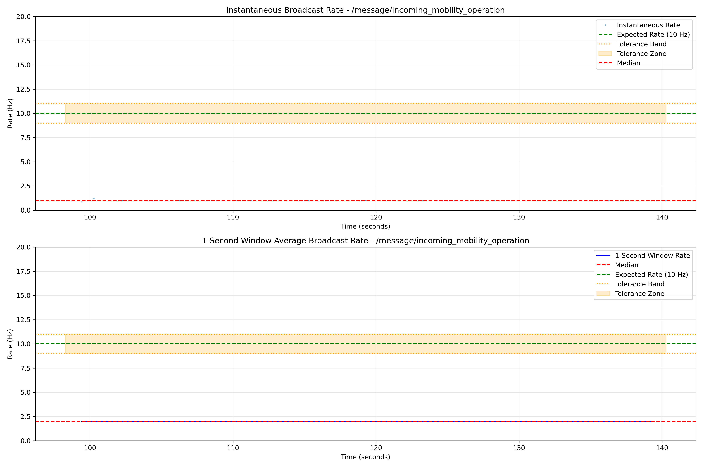
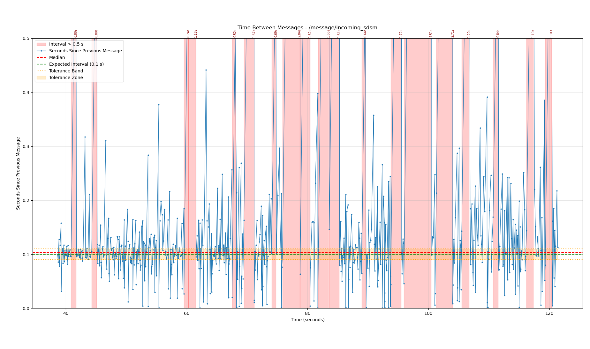

# Message Scripts

This file contains various analysis functions for analyzing messages to/from Carma Cloud.

## Functions

### process_tomcat_logs
Reads Carma Cloud .log files to process TrafficControlRequest and TrafficControlMessages. NOTE: Assumes every file in the directory is a .log file and that all logs were taken on the same day

#### Parameters
- `cc_data_path`: Path to directory containing cc.log files
- `log_data`: String with the day the logs were taken to convert log times to Unix Epoch time
- `max_delay`: Maximum allowed delay between TCR receipt and TCM Broadcast
- `expected_rate`: Rate in Hz at which any TCM is expected to be broadcasted at

#### Output
Returns:
- A dictionary of dictionaries containing:
    all_results:
        'reqid':
            'tcr_time':
            'first_tcm_time':
            'response_delay':
            'tcm_1':
                'timestamps':
                'msgnum':
                'count':
                'rate':
            'tcm_2': ...
- Saves statistics as JSON, data as NPZ, and plot as PNG (if directories are provided)

### check_cc_response_delay
Checks the delay between Carma Cloud receiving a TCR from the vehicle and sending a TCM

#### Parameters
- `all_cc_data`: Dictionary of dictionaries containing Carma Cloud TCR/TCM data
- `expected_delay`: Maximum expected delay between TCR Receipt and TCM Broadcast

#### Output
- `is_successful`: Boolean - True if all TCR->TCM delays are under the given threshold

### check_tcm_acknowledgements
Verifies that all TCM's received by the vehicle are acknowledged within a specified time

#### Parameters
- `mcap_path`: Path to MCAP file
- `max_delay`" Maximum allowed time the vehicle can take to acknowledge a received TCM

#### Output
Returns
- `is_successful`: Boolean - True if all TCMs are acknowledged within the specified time
- `tcm_acknowledgements`: List of tuples (TCM reqid, TCM msgnum, TCM receipt time, TCM acknowledgement time)
- Saves statistics as JSON, data as NPZ, and plot as PNG (if directories are provided)

### check_tcm_broadcast_count
Verifies each TCM was broadcasted a given number of times, or was acknowledged by the vehicle. NOTE: Acknowledgement information strictly comes from the vehicle. Does not verify Carma Cloud received the acknowledgement from the vehicle

#### Parameters
- `all_cc_data`: Dictionary of dictionaries containing Carma Cloud TCR/TCM data
- `tcm_acknowledgements`: List of tuples (TCM reqid, TCM msgnum, TCM receipt time, TCM acknowledgement time)
- `expected_broadcasts`: Number of times a TCM is expected to be broadcasted

#### Output
- `is_successful`: Boolean - True if all TCMs were broadcasted a given number of times, or were acknowledged by the vehicle.
- Saves statistics as JSON, and data as NPZ (if directories are provided)

### check_tcm_broadcast_rate
Verifies each TCM was broadcasted at a given rate, or was acknowledged by the vehicle. NOTE: Acknowledgement information strictly comes from the vehicle. Does not verify Carma Cloud received the acknowledgement from the vehicle

#### Parameters
- `all_cc_data`: Dictionary of dictionaries containing Carma Cloud TCR/TCM data
- `tcm_acknowledgements`: List of tuples (TCM reqid, TCM msgnum, TCM receipt time, TCM acknowledgement time)
- `expected_rate`: Expected broadcast rate of TCMs in Hz

#### Output
- `is_successful`: Boolean - True if all TCMs were broadcasted at the given rate, or were acknowledged by the vehicle.
- Saves statistics as JSON, and data as NPZ (if directories are provided)

### check_tcm_response_time
Verifies that after sending a TCR, the vehicle receives a TCM within a specified time

#### Parameters
- `mcap_path`: Path to MCAP file
- `expected_tcr_to_tcm_duration`: Maximum amount of time allowed between sending a TCR and receiving a TCM

#### Output
- `is_successful`: Boolean - True if all TCRs sent have a received TCM within the specified time
- Saves statistics as JSON, data as NPZ, and plot as PNG (if directories are provided)

### check_message_broadcast_rate
Analyzes the broadcast rate of messages on any given topic to verify they are transmitted at the expected frequency. Uses both instantaneous rates and rolling window averages to determine if message timing meets requirements.

#### Parameters
- `mcap_path`: Path to MCAP file
- `topic_name`: Name of the ROS topic to analyze (e.g., "/message/incoming_mobility_operation")
- `expected_rate_hz`: Expected broadcast rate in Hz
- `rate_tolerance_pct`: Tolerance percentage for rate matching (default: 0.1 = 10%)
- `start_time`: Time to start the analysis (optional)
- `end_time`: Time to end the analysis (optional)
- `save_stats_dir`: Directory to save analysis stats (optional)
- `save_data_dir`: Directory to save extracted data (optional)
- `save_plot_dir`: Directory to save generated plots (optional)

#### Output
Returns:
- `is_passed`: Boolean indicating if broadcast rate meets requirements (passes if ≥95% of time windows are within tolerance)
- `stats`: Dictionary with statistical analysis including instantaneous and rolling window rate statistics
- `figure`: Matplotlib figure object with two subplots showing instantaneous and 1-second window average rates
- `broadcast_intervals`: Array of time intervals between messages
- `timestamps`: Array of message timestamps
- Saves statistics as JSON, data as NPZ, and plot as PNG (if directories are provided)

### plot_message_time_intervals
Plots the number of seconds between consecutive messages on a given topic, highlighting intervals that fall outside an expected tolerance band and annotating any interval that exceeds the plot's y-axis view. Optionally filters by `message_type` first, for topics like `INCOMING_BINARY_MSG_TOPIC` (`carma_driver_msgs/msg/ByteArray`) that carry multiple message types (`BINARY_MSG_TYPE_CHOICES`: SensorDataSharingMessage, BSM, SPAT, MAP) on one topic.

#### Parameters
- `mcap_path`: Path to MCAP file
- `topic_name`: Name of the ROS topic to analyze (e.g., `INCOMING_SDSM_TOPIC`, `INCOMING_BINARY_MSG_TOPIC`)
- `message_type`: Optional value to filter the topic's message_type field on (optional)
- `expected_interval_sec`: Expected number of seconds between consecutive messages (default: 0.1)
- `interval_tolerance_pct`: Tolerance percentage around the expected interval (default: 0.1 = 10%)
- `save_plot_dir`: Directory to save generated plot (optional)

#### Output
Returns:
- `figure`: Matplotlib figure object
- `timestamps`: Array of message timestamps (seconds from start of recording)
- `intervals`: Array of seconds between consecutive messages

