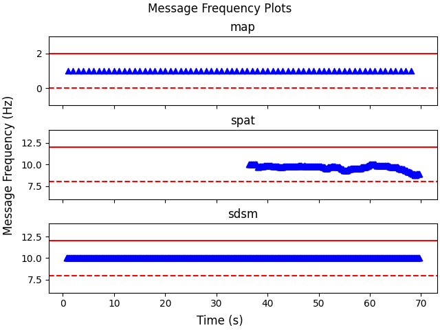

# CARMA Streets Data Analysis
## Introduction
This Package contains several Python Modules useful for parsing Kafka Topic logs into csv format for plotting and data analysis.
## Collecting Kafka Logs
Documentation for data collection for **CARMA Streets** can be found [here](https://github.com/usdot-fhwa-stol/carma-streets/tree/release/lavida?tab=readme-ov-file#data-collection). To collect Kafka Topic log data, the Kafka docker image must still be running. Using the `collect_kafka_logs.py` script you can collect all the messages on each topic. Each topic will generate a log file with the json messages exchandeg on the topic and a timestamp for when Kafka "Created" the message. This "Created" timestamp can be treated as the time at which **CARMA Streets** received the message.
## Parsing Kafka logs to CSV 
The `parse_kafka_logs.py` is intended for use with to collected Kafka logs using the `collect_kafka_losg.py` script. It will search a provided directory for a log file for each supported Kafka Message type and output a CSV file containing the message data.
```
usage: parse_kafka_logs.py [-h] --kafka-log-dir KAFKA_LOG_DIR --csv-dir CSV_DIR [--simulation]

Script to parse Kafka Topic log files into CSV data

options:
  -h, --help            show this help message and exit
  --kafka-log-dir KAFKA_LOG_DIR
                        Directory containing Kafka Log files.
  --csv-dir CSV_DIR     Directory to write csv files to.
  --simulation          Flag indicating data is from simulation
```
## Plotting Message Frequency
The `plot_message_frequencies.py` is intended for use with the `parse_kafka_logs.py` output. Using the generated CSV data, this plotting script will create multiple message frequency sub plots, one for each file of CSV message data. It can be used for plotting message frequency in both simulation and real-time. To plot simulation message frequency, use the `--simulation` parameter for both scripts.
```
usage: plot_message_frequencies.py [-h] --csv-dir CSV_DIR --plots-dir PLOTS_DIR [--simulation]

Script to plot message frequency from CARMA Streets message csv data.

options:
  -h, --help            show this help message and exit
  --csv-dir CSV_DIR     Directory to read csv data from.
  --plots-dir PLOTS_DIR
                        Directory to save generated plots.
  --simulation          Flag indicating data is from simulation
```
## Example Ouput:
