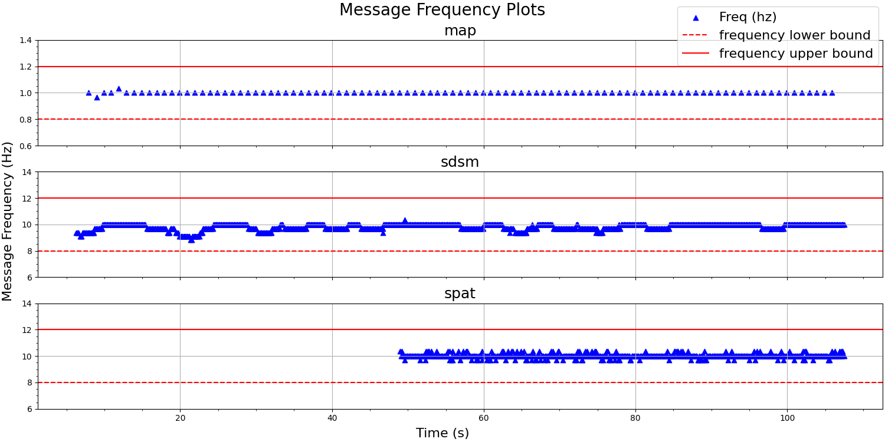
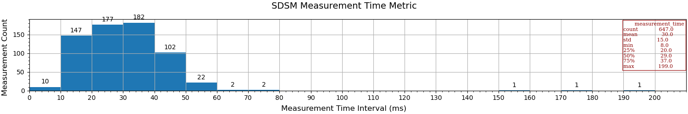

# CARMA Streets Data Analysis
## Introduction
This Package contains several Python Modules useful for parsing Kafka Topic logs into csv format for plotting and data analysis.
## Collecting Kafka Logs
Documentation for data collection for **CARMA Streets** can be found [here](https://github.com/usdot-fhwa-stol/carma-streets/tree/release/lavida?tab=readme-ov-file#data-collection). To collect Kafka Topic log data, the Kafka docker image must still be running. Using the `collect_kafka_logs.py` script you can collect all the messages on each topic. Each topic will generate a log file with the json messages exchandeg on the topic and a timestamp for when Kafka "Created" the message. This "Created" timestamp can be treated as the time at which **CARMA Streets** received the message.
## Parsing Kafka logs to CSV 
The `parse_kafka_logs.py` is intended for use with to collected Kafka logs using the `collect_kafka_losg.py` script. It will search a provided directory for a log file for each supported Kafka Message type and output a CSV file containing the message data.
```
usage: parse_kafka_logs.py [-h] --kafka-log-dir KAFKA_LOG_DIR --csv-dir CSV_DIR [--simulation]

Script to parse Kafka Topic log files into CSV data

options:
  -h, --help            show this help message and exit
  --kafka-log-dir KAFKA_LOG_DIR
                        Directory containing Kafka Log files.
  --csv-dir CSV_DIR     Directory to write csv files to.
  --simulation          Flag indicating data is from simulation
```
## Plotting Message Frequency
The `plot_message_frequencies.py` is intended for use with the `parse_kafka_logs.py` output. Using the generated CSV data, this plotting script will create multiple message frequency sub plots, one for each file of CSV message data. It can be used for plotting message frequency in both simulation and real-time. To plot simulation message frequency, use the `--simulation` parameter for both scripts.
```
usage: plot_message_frequencies.py [-h] --csv-dir CSV_DIR --plots-dir PLOTS_DIR [--simulation]

Script to plot message frequency from CARMA Streets message csv data.

options:
  -h, --help            show this help message and exit
  --csv-dir CSV_DIR     Directory to read csv data from.
  --plots-dir PLOTS_DIR
                        Directory to save generated plots.
  --simulation          Flag indicating data is from simulation
```
## Example Ouput:


## Plot Measurement Time Interval
The `measurement_time_metric.py` is a python script to calculate measurement time distribution within a predefined intervals and plot the result in a bar chart.
```
usage: python3 measurement_time_metric.py [-h] --csv-dir CSV_DIR --plots-dir PLOTS_DIR

Script to plot measurement time interval count from CARMA Streets sensor data sharing message (SDSM) csv data.

options:
  -h, --help            show this help message and exit
  --csv-dir CSV_DIR     Directory to read csv data from.
  --plots-dir PLOTS_DIR
                        Directory to save generated plots.
```
### Example output
```
python3 measurement_time_metric.py  --csv-dir sdsm_kafka_30HZ_R1  --plots-dir sdsm_kafka_30HZ_R1_plots
```


## CP-01 Detection Drop Characterization
The `detection_drop_characterization.py` script characterizes how many detection frames were dropped on the detected object Kafka topic (`v2xhub_sim_sensor_detected_object`) while a pedestrian stood in the detection zone for a known duration. Recorded entry times only need to be approximate: each run's window starts at the first detection at or after its entry time and spans that run's duration. Unique frames received in the window are compared against `duration * rate` expected frames. The script writes a per-run CSV and a plot of each run's drop percentage and where in the run frames were dropped.

Record entry times early rather than late: a late entry time starts the window mid-run, so frames expected after the pedestrian actually left are counted as dropped.
```
usage: detection_drop_characterization.py [-h] --kafka-log-dir KAFKA_LOG_DIR
                                          --entry-times ENTRY_TIMES
                                          [ENTRY_TIMES ...] --durations
                                          DURATIONS [DURATIONS ...]
                                          --plots-dir PLOTS_DIR
                                          [--rate-hz RATE_HZ]
                                          [--timezone TIMEZONE]
                                          [--max-first-detection-delay MAX_FIRST_DETECTION_DELAY]

Script to characterize dropped detection frames from a CARMA Streets detected
object Kafka log, over runs where a pedestrian stood in the detection zone for
a known duration.

options:
  -h, --help            show this help message and exit
  --kafka-log-dir KAFKA_LOG_DIR
                        Directory containing Kafka Log files.
  --entry-times ENTRY_TIMES [ENTRY_TIMES ...]
                        Recorded time the pedestrian entered the detection
                        zone for each run, as epoch seconds or datetime
                        strings (e.g. "2026-09-03 14:03:21").
  --durations DURATIONS [DURATIONS ...]
                        Seconds the pedestrian stayed in the detection zone,
                        one per entry time.
  --plots-dir PLOTS_DIR
                        Directory to save generated plot and per-run csv.
  --rate-hz RATE_HZ     Expected detection frame rate.
  --timezone TIMEZONE   Timezone of naive entry time strings.
  --max-first-detection-delay MAX_FIRST_DETECTION_DELAY
                        Seconds after an entry time to look for the run's
                        first detection before treating the run as undetected.
```
### Example usage
```
python3 detection_drop_characterization.py --kafka-log-dir kafka-logs --entry-times "2026-09-03 14:03:19" "2026-09-03 14:03:51" --durations 25 25 --plots-dir detection_drop_plots
```

## CS-01 SDSM Location Spoofing Verification
The `sdsm_location_spoofing_verification.py` script verifies that SDSMs place a location-spoofed pedestrian at the remote reference location configured in `FLIRCameraDriver`. Collect Kafka logs (`collect_kafka_logs.sh`) after one run where the pedestrian is detected; any mcap from that run can optionally be added to also verify the SDSMs CARMA Platform received.

`FLIRCameraDriver` discards the camera's true location and reports each detection on `v2xhub_sim_sensor_detected_object` as cartesian (east, north) offsets from the configured reference lat/lon, which it writes as the `lat_0`/`lon_0` of the detection's `projString`. The configured reference heading is already applied to these offsets (the script prints the rotation it measures between the camera's true-frame `wgs84Position` and the reported `position`), so it is not applied again. Each SDSM object is paired with its source detection by object ID and detection time (`sdsm_time_stamp - measurement_time`), and:
- **Position**: the SDSM object location, `ref_pos` plus its NED offsets (`offset_x` north, `offset_y` east), is compared against the reference lat/lon plus the detection offsets. Passes if the mean error is below 0.2 m.
- **Heading**: the SDSM object heading is compared against the heading of the detection's velocity, for detections moving at least 0.1 m/s. Passes if the mean absolute error is below 1 degree.

Only detections whose `projString` origin matches `--ref-lat`/`--ref-lon` are verified, so logs that also contain runs with other references are fine. The script writes a per-object CSV and a plot, prints PASS/FAIL per SDSM source, and exits 0 on PASS, 1 on FAIL and 2 on bad input.
```
usage: sdsm_location_spoofing_verification.py [-h] --kafka-log-dir
                                              KAFKA_LOG_DIR --ref-lat REF_LAT
                                              --ref-lon REF_LON
                                              [--sdsm-log SDSM_LOG]
                                              [--mcap MCAP] --plots-dir
                                              PLOTS_DIR
                                              [--max-mean-position-error MAX_MEAN_POSITION_ERROR]
                                              [--max-mean-heading-error MAX_MEAN_HEADING_ERROR]
                                              [--min-heading-speed MIN_HEADING_SPEED]
                                              [--match-tolerance-ms MATCH_TOLERANCE_MS]

Verify SDSMs place a location-spoofed pedestrian at the remote reference
location configured in FLIRCameraDriver, by comparing each SDSM
object's location and heading against its source detection on the detected
object Kafka topic.

options:
  -h, --help            show this help message and exit
  --kafka-log-dir KAFKA_LOG_DIR
                        Directory containing Kafka Log files.
  --ref-lat REF_LAT     Remote reference latitude configured in
                        FLIRCameraDriver.
  --ref-lon REF_LON     Remote reference longitude configured in
                        FLIRCameraDriver.
  --sdsm-log SDSM_LOG   SDSM Kafka log to verify. Default is the non-empty
                        *sdsm*.log in --kafka-log-dir.
  --mcap MCAP           CARMA Platform mcap whose /message/incoming_sdsm SDSMs
                        are also verified. Requires ROS 2 and carma_v2x_msgs
                        to be sourced.
  --plots-dir PLOTS_DIR
                        Directory to save generated plot and per-object csv.
  --max-mean-position-error MAX_MEAN_POSITION_ERROR
                        Pass threshold on mean SDSM position error, in meters.
  --max-mean-heading-error MAX_MEAN_HEADING_ERROR
                        Pass threshold on mean absolute SDSM heading error, in
                        degrees.
  --min-heading-speed MIN_HEADING_SPEED
                        Detections slower than this (m/s) have no meaningful
                        heading and are left out of the heading error.
  --match-tolerance-ms MATCH_TOLERANCE_MS
                        Allowed difference between an SDSM object's
                        measurement time and its source detection's timestamp.
```
### Example usage
```
python3 sdsm_location_spoofing_verification.py --kafka-log-dir kafka-logs --ref-lat 38.955018 --ref-lon -77.1484523 --mcap rosbag2_2026-09-03_141220_0.mcap --plots-dir cs01_plots
```