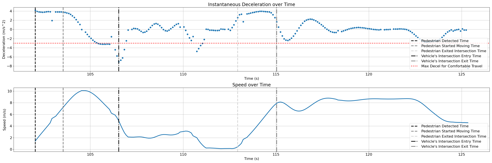

# VRU use-case scripts

This directory contains scripts to help with data analysis for VRU use-cases.

## `extract_rtf_data`

This script takes in a Docker container log output and extracts realtime factor (RTF) data, outputting the results as
comma-separated values (CSV) with the following format:

```text
<sim_time_nanoseconds>,<rtf_value>
<sim_time_nanoseconds>,<rtf_value>
...
<sim_time_nanoseconds>,<rtf_value>
```

### Usage examples

Output the CSV data directly to the terminal:

```console
docker logs carma-simulation 2>&1 | ./extract_rtf_data
```

Output the CSV data to a file:

```console
docker logs carma-simulation 2>&1 | ./extract_rtf_data > rtf_data.csv
```

Pipe the CSV data into the `plot_rtf_data` script (see below):

```console
docker logs carma-simulation 2>&1 | ./extract_rtf_data | ./plot_rtf_data
```

## `plot_rtf_data`

This script takes in CSV-formatted RTF data from standard input or a file and plots the results. This script
has an optional `--min-required` argument that will plot a horizontal line at the level specified.

### Usage examples

Plot the RTF data from a file:

```console
./plot_rtf_data rtf_data.csv
```

```console
./plot_rtf_data --min-required 0.50 rtf_data.csv
```

Plot the RTF data from standard input (_e.g._, through a pipe):

```console
docker logs carma-simulation 2>&1 | ./extract_rtf_data | ./plot_rtf_data
```

```console
docker logs carma-simulation 2>&1 | ./extract_rtf_data | ./plot_rtf_data --min-required 0.35
```

## `plot_sdsm_position_error`

This script takes in two CSV files containing detected object and SDSM reports generated from V2XHub logs. It plots the
position difference between entries in the two files. For each detected object and for each timestamp, the script
searches in the SDSM CSV file for a corresponding entry. It then calculates the distance between the two entires.
Finally, the script plots the results for each object for the duration of the simulation.

> [!NOTE]
> This script relies on the CSV files generated by the `parse_kafka_logs.py` script.

### Usage examples

Plot the data:

```console
./plot_sdsm_position_error \
  --sdsm-csv <path_to_csv_dir>/sdsm.csv \
  --detection-csv <path_to_csv_dir>/detected_object.csv
```

### Example output


## `plot_detected_objects`

This script takes in data about vehicle-detected and SDSM-reported objects. It then plots
their positions along with the error between what the vehicle detected and what the SDSMs
reported.

> [!NOTE]
> This script relies on the CSV files generated by the `parse_kafka_logs.py` script.

### Usage examples

Plot the data:

```console
./plot_detected_objects \
  --sdsm-csv <path_to_csv_dir>/sdsm.csv \
  --vehicle-detection-csv <path_to_csv_dir>/vehicle_detected_objects.csv \
  --infrastructure-sensors-json <path_to_sensor_config>/sensors.json
```

### Example output


## `plot_time_to_collision`

This script takes in two CSV files containing vehicle and pedestrian odometry generated from rosbags.
For each vehicle odometry point, the script propagates the vehicle forward along the path while keeping
the vehicle's longitudinal velocity fixed. While propagating the vehicle forward, the script checks
for collisions with the pedestrian. If there is a collision, the script uses the elapsed traversal
time as the time to collision (TTC).

> [!NOTE]
> This script assumes the vehicle and pedestrian are point masses, and the `COLLISION_THRESHOLD_M` variable determines
> when a collision occurs.

> [!NOTE]
> When running this script on data generated from CDASim, the vehicle's odometry positions are its center mass, not
> the rear axle.

> [!NOTE]
> This script relies on the CSV files generated by the `parse_kafka_logs.py` script.

### Usage examples

Plot the data:
```console
./plot_time_to_collision \
  --vehicle-odometry-csv <path_to_csv_dir>/vehicle_odometry.csv \
  --pedestrian-odometry-csv <path_to_csv_dir>/pedestrian_odometry.csv
```

### Example output


## `monitor_time_sync_through_logs`

This script monitors real-time or in post-process whether if all components are stepping in synchronization ensuring their simulation time synchronization.
Default mode shows a simulation timestamp vs is_synced boolean value graph to indicate whether if all the specified tools in the cdasim is synchronized
> [!NOTE]
> This script relies on python libraries watchdog and docker for real-time

> [!NOTE]
> Graph is not automatically saved, please be sure to save it before closing if needed when using real-time

After starting cdasim through carma start all, give few seconds before running:
```console
./monitor_time_sync_through_logs
```
other options:
```
  --show-plot           Show plot of the time synchronization monitoring process. Default True
  --debug-mode          Debug mode turns on additional graphs displaying each tool's delay. Default False.
  --post-process-mode   Post process mode finds the log already generated. If --input-logs-dir is provided, it looks in that folder. Default False.
  --input-logs-dir INPUT_LOGS_DIR
                        Directory to look for input logs. Default folders are where each tool normally generates logs.
  --plots-dir PLOTS_DIR
                        Directory to store generated plots.
```

### Example output
Red line shows how long in system wall time it took for MOSAIC to step to the next simulation time step.
Blue lines show the delay of each tools experience when setting the simulation time step since MOSAIC commanded the first tool to advance.
Therefore we consider the time is synchronized if every tool received the next timestep before next timestep was broadcasted by MOSAIC.
This would translate to blue lines being under the red ones indicating no tool experienced significant
delay more than MOSAIC allowed between each simulation timesteps.
First subplot on the top indicates whether of all tools are synced or not according to above criteria where 1:Synced 0: Not.
MOSAIC.log is MOSAIC time
vx2hub.log is V2XHub time
Traffic.log is sumo and carla time (since they are synced)
rosout.log is ROS time


The synchronization boolean and timestamp on the graph is saved only when all tools report their respective delays on given timestamp.
Here is an example if one of the timestamp is missing an entry from one of the tool.
Black dotted vertical lines indicated the missing timestamp, which shows up as NOT synchronized:


## `plot_cp_stack_processing_time`

This script takes in one CSV files containing vehicle's cp objects with simulation received time generated from rosbags.
It extracts the simulation time (s) it takes for CP stack to process an object

> [!NOTE]
> First, this script extracts processing time from the how frequent is the stack's output.
> This is because the script's requirement is to measure processing time in simulation time, not wall time, and
> currently CP stack's operation period is same (or more) as the minimum clock resolution of the simulation (step
> duration, 0.1s)
> Therefore, we should expect the processing time in simulation time to be no more than 0.1s if it took less than
> 0.1s in wall time. And 0.2s in simulation time if it took 0.1s to 0.2s in wall time etc.
> However, due to ROS scheduling combined with a large step duration, sometimes the output can get reported on the
> next next timestep.
> For example, if ROS scheduled first operation at wall time 97ms, and if processing took 2ms wall time, the output
> will be at wall time 99ms (which is stil simulation time 0.0s and is expected). Next if ROS scheduled slightly
> later at 199ms
> (instead of 197ms wall time) the output maybe reported at simulation time 0.2s instead of 0.1s just because it was
> reported at all wall time 201ms. So the output jumped from 0.0s to 0.2s in simulation time, despite only taking 2ms
> wall time to process.
> So it is appropriate to expect:
> expected_cp_processing_time + 1 simulation_step_duration, which is highlited with red line


### Usage examples

Extract the processing time to terminal:

```console
./plot_cp_stack_processing_time
  --vehicle-detection-csv <path_to_csv_dir>/detected_objects_with_sim_received_time.csv
  --show-plot
  --plots-dir <dir-to-save-image>
```

### Example Output


## `plot_missing_object_durations`

This script plots the duration of consecutive time the detected object is missing.
It takes in one CSV files containing vehicle's cp objects respective detected simulation time in their messages generated from rosbags.

> [!NOTE]
> This script is tighly coupled with how to VRU use case scenario is setup. It assumes that the infrastructure sensor detects
> all the objects in the intersection and feeds CP stack the info without fail at all time steps. Therefore, if an object is missing from
> the output of the CP stack, it would be interpreted as CP stack's misbehavior although it can technically be just that infrastructure
> did not send the object data for those times.

> [!NOTE]
> Missing duration is also tightly coupled with the CP stack's operation_period. Object will be missing minimum operation_period time and
> has a resolution error of operation_period

### Usage examples

```console
./plot_missing_object_durations
  --vehicle-detection-csv <path_to_csv_dir>/vehicle_detected_objects.csv.csv
```
### Example output


## `plot_deceleration_and_speed`

This script takes in one required argument - rosbag and plots the deceleration value between each twist msgs of the platform and corresponding speeds used to generate the decel graph. Other optional arguments are to `--show-plot` which shows the plot
and `--plots-dir` which specified the directory to save the graph (by default, it creates `figures` folder in the current directory)

Furthermore, the graph contains timestamps when the pedestrian was detected, started moving, and exited the crosswalk (using positional values only valid for intersection SumoID 785 in Town04). It also has timestamps when the vehicle entered the intersection and exited.

> [!NOTE]
> This script low pass filters the speed before plotting to filter the short term noise

> [!NOTE]
> If the pedestrian was detected very early on, the plot will show a vertical line at the time when platform starts moving for better plotting. The terminal output will have a correct timestam when the pedestrian was detected by the CP stack.

### Usage examples

Plot the data:

```console
./plot_deceleration_and_speed \
  --rosbag <dir-to-rosbag>
```
or:
```console
./plot_deceleration_and_speed \
  --rosbag <dir-to-rosbag>
  --show-plot
  --plots-dir <dir-to-save-image>
```

### Example output



in terminal:

```
Detected entry time into the intersection (lanelet id: 61405) at: 106.525044967
Detected exit time out of the intersection (from lanelet id: 11568) at: 117.525045131
Detected pedestrian detected_t_sec: 28.325043802
Detected pedestrian started_moving_t_sec: 103.225044918
Detected pedestrian exited_crosswalk_t_sec: 112.625045058
```

## `calc_post_encroachment_time`

This script takes in two CSV files containing vehicle and pedestrian odometry generated from rosbags. It calculates
the post-encroachment time (PET), which is the duration between the pedestrian leaving the encroachment zone and the
vehicle entering it. The script optionally plots the odometry information and visualizes the encroachment.

> [!NOTE]
> This script assumes the vehicle and pedestrian are point masses, and the `ENCROACHMENT_ZONE_WIDTH` variable determines the size of the encroachment zone.

> [!NOTE]
> This script uses several hardcoded values to generate expected post-encroachment time. This includes <br>
> `HARDCODED_MAX_ACCEL_MS2`: 3.0 mps^2 is used as a safe comfortable acceleration value<br>
> `HARDCODED_MAX_VEHICLE_SPEED_MS`: 30mph is used as a limit, but actual speed used to generate is determined from the vehicle's whole odometry profile.<br>
> `PET_EXPECTED_TIME_BUFFER_S`: 3.0 sec is allocated to account for controller reaction issues such as CARLA shifting gears from stopped to going.<br>

### Usage examples

Calculate the PET:

```console
./calc_post_encroachment_time \
  --vehicle-odometry-csv <path_to_csv_dir>/vehicle_odometry.csv \
  --pedestrian-odometry-csv <path_to_csv_dir>/pedestrian_odometry.csv
```

Calculate the PET (with plotting):

```console
./calc_post_encroachment_time \
  --vehicle-odometry-csv <path_to_csv_dir>/vehicle_odometry.csv \
  --pedestrian-odometry-csv <path_to_csv_dir>/pedestrian_odometry.csv \
  --show-plot
```

### Example output

```console
Calculating expected post-encroachment time with buffer [ms]: 3000
dist_to_conflict_point [meters]: 11.16
Max velocity [mps] found from vehicle odometry: 5.24
dist_from_stationary_to_max_speed [meters]: 4.57
initial expected_encroachment_time [s]: 3.00
vehicle enter time [ms]: 75490
pedestrian exit time [ms]: 69900
post-encroachment time (PET) [ms]: 5590
expected post-encroachment time [ms]: 6005
Satisfied expected PET?: True, with difference [ms]: 415
```

## run_all_analysis_scripts

This scripts runs the above scripts for all VRU scenarios in a directory.

> [!NOTE]
> This script assumes each subdirectory within the specified directory contains all the data for that specific run.
> For example:
```
simulation_data
├── run1
│   ├── _2024-03-22-16-56-19.bag
│   ├── carma_streets_kafka_2024-03-22_12-48-53.zip
│   ├── cdasim_rtf_data_2024-03-22_12-49-11.csv
│   ├── sensors.json
│   ├── simulation_logs_20240322-20240325
│   ├── v2xhub_logs_20240322-20240325.zip
│   ├── VulnerableRoadUserCollision_ThreeTrucks-1.json
│   └── ...
│ 
└── run2
    ├── _2024-03-22-17-44-20.bag
    ├── carma_streets_kafka_2024-03-22_12-58-10.zip
    ├── cdasim_rtf_data_2024-03-22_12-58-27.csv
    ├── sensors.json
    ├── VulnerableRoadUserCollision_ThreeTrucks-2.json
    └── ...
```

### Usage examples

```console
./run_all_analysis_scripts --input-dir <path_to_run_subdirs>
```
