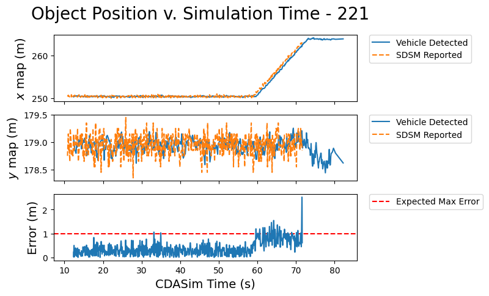
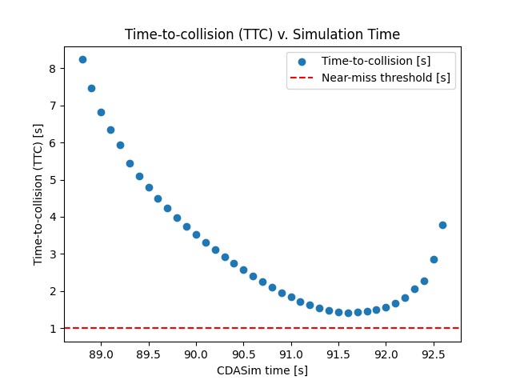

# VRU use-case scripts

This directory contains scripts to help with data analysis for VRU use-cases.

## `extract_rtf_data`

This script takes in a Docker container log output and extracts realtime factor (RTF) data, outputting the results as
comma-separated values (CSV) with the following format:

```text
<sim_time_nanoseconds>,<rtf_value>
<sim_time_nanoseconds>,<rtf_value>
...
<sim_time_nanoseconds>,<rtf_value>
```

### Usage examples

Output the CSV data directly to the terminal:

```console
docker logs carma-simulation 2>&1 | ./extract_rtf_data
```

Output the CSV data to a file:

```console
docker logs carma-simulation 2>&1 | ./extract_rtf_data > rtf_data.csv
```

Pipe the CSV data into the `plot_rtf_data` script (see below):

```console
docker logs carma-simulation 2>&1 | ./extract_rtf_data | ./plot_rtf_data
```

## `plot_rtf_data`

This script takes in CSV-formatted RTF data from standard input or a file and plots the results. This script
has an optional `--min-required` argument that will plot a horizontal line at the level specified.

### Usage examples

Plot the RTF data from a file:

```console
./plot_rtf_data rtf_data.csv
```

```console
./plot_rtf_data --min-required 0.50 rtf_data.csv
```

Plot the RTF data from standard input (_e.g._, through a pipe):

```console
docker logs carma-simulation 2>&1 | ./extract_rtf_data | ./plot_rtf_data
```

```console
docker logs carma-simulation 2>&1 | ./extract_rtf_data | ./plot_rtf_data --min-required 0.35
```

## `plot_sdsm_position_error`

This script takes in two CSV files containing detected object and SDSM reports generated from V2XHub logs. It plots the
position difference between entries in the two files. For each detected object and for each timestamp, the script
searches in the SDSM CSV file for a corresponding entry. It then calculates the distance between the two entires.
Finally, the script plots the results for each object for the duration of the simulation.

> [!NOTE]
> This script relies on the CSV files generated by the `parse_kafka_logs.py` script.

### Usage examples

Plot the data:

```console
./plot_sdsm_position_error \
  --sdsm-csv <path_to_csv_dir>/sdsm.csv \
  --detection-csv <path_to_csv_dir>/detected_object.csv
```

### Example output


## `plot_detected_objects`

This script takes in data about vehicle-detected and SDSM-reported objects. It then plots
their positions along with the error between what the vehicle detected and what the SDSMs
reported.

> [!NOTE]
> This script relies on the CSV files generated by the `parse_kafka_logs.py` script.

### Usage examples

Plot the data:

```console
./plot_detected_objects \
  --sdsm-csv <path_to_csv_dir>/sdsm.csv \
  --vehicle-detection-csv <path_to_csv_dir>/vehicle_detected_objects.csv \
  --infrastructure-sensors-json <path_to_sensor_config>/sensors.json
```

### Example output



## `plot_time_to_collision`

This script takes in two CSV files containing vehicle and pedestrian odometry generated from rosbags.
For each vehicle odometry point, the script propagates the vehicle forward along the path while keeping
the vehicle's longitudinal velocity fixed. While propagating the vehicle forward, the script checks
for collisions with the pedestrian. If there is a collision, the script uses the elapsed traversal
time as the time to collision (TTC).

> [!NOTE]
> This script assumes the vehicle and pedestrian are point masses, and the `COLLISION_THRESHOLD_M` variable determines
> when a collision occurs.

> [!NOTE]
> When running this script on data generated from CDASim, the vehicle's odometry positions are its center mass, not
> the rear axle.

> [!NOTE]
> This script relies on the CSV files generated by the `parse_kafka_logs.py` script.

### Usage examples

Plot the data:

```console
./plot_time_to_collision \
  --vehicle-odometry-csv <path_to_csv_dir>/vehicle_odometry.csv \
  --pedestrian-odometry-csv <path_to_csv_dir>/pedestrian_odometry.csv
```

### Example output




## `extract_cp_stack_processing_time`

This script takes in two CSV files containing vehicle's cp objects and objects from incoming_sdsm with
their respective simulation times generated from rosbags.
It extracts the simulation time (ms) it takes for CP stack to process an object

> [!NOTE]
> Measuring processing time from ros bag is only possible for the pedestrian data in this use case
> This is because pedestrian is occluded form the vehicle, its data only comes from sdsm
> Therefore, from the first time pedestrian was detected in the sdsm and until it became available
> on fused object topic is the processing time


### Usage examples

Extract the processing time to terminal:

```console
./extract_cp_stack_processing_time
  --vehicle-detection-csv <path_to_csv_dir>/detected_objects_with_sim_received_time.csv
  --sdsm-csv <path_to_csv_dir>/detected_objects_from_incoming_sdsm.csv
```

### Example Output

```console
Simulation Time (ms) processing for Cooperative Perception Stack (Input from SDSM to output on local perception): 400.0
```

## `plot_missing_object_durations`

This script plots the duration of consecutive time the detected object is missing.
It takes in one CSV files containing vehicle's cp objects respective detected simulation time in their messages generated from rosbags.

> [!NOTE]
> This script is tighly coupled with how to VRU use case scenario is setup. It assumes that the infrastructure sensor detects
> all the objects in the intersection and feeds CP stack the info without fail at all time steps. Therefore, if an object is missing from
> the output of the CP stack, it would be interpreted as CP stack's misbehavior although it can technically be just that infrastructure
> did not send the object data for those times.

> [!NOTE]
> Missing duration is also tightly coupled with the CP stack's operation_period. Object will be missing minimum operation_period time and
> has a resolution error of operation_period

### Usage examples

```console
./plot_missing_object_durations
  --vehicle-detection-csv <path_to_csv_dir>/vehicle_detected_objects.csv.csv
```

### Example output


## `calc_post_encroachment_time`

This script takes in two CSV files containing vehicle and pedestrian odometry generated from rosbags. It calculates
the post-encroachment time (PET), which is the duration between the pedestrian leaving the encroachment zone and the
vehicle entering it. The script optionally plots the odometry information and visualizes the encroachment.

> [!NOTE]
> This script assumes the vehicle and pedestrian are point masses, and the `ENCROACHMENT_ZONE_WIDTH` variable determines the size of the encroachment zone.

### Usage examples

Calculate the PET:

```console
./calc_post_encroachment_time \
  --vehicle-odometry-csv <path_to_csv_dir>/vehicle_odometry.csv \
  --pedestrian-odometry-csv <path_to_csv_dir>/pedestrian_odometry.csv
```

Calculate the PET (with plotting):

```console
./calc_post_encroachment_time \
  --vehicle-odometry-csv <path_to_csv_dir>/vehicle_odometry.csv \
  --pedestrian-odometry-csv <path_to_csv_dir>/pedestrian_odometry.csv \
  --show-plot
```

### Example output

```console
vehicle enter time [ms]: 57130.000002
pedestrian exit time [ms]: 51800.0007
post-encroachment time (PET) [ms]: 5329.999302000004
```

## `run_all_analysis_scripts

This scripts runs the above scripts for all VRU scenarios in a directory.

> [!NOTE]
> This script assumes each subdirectory within the specified directory contains all the data for that specific run

### Usage examples

```console
./run_all_analysis_scripts --input-dir <path_to_run_subdirs>
```
